## SDUTNews-立体网页设计及CSS动画进阶
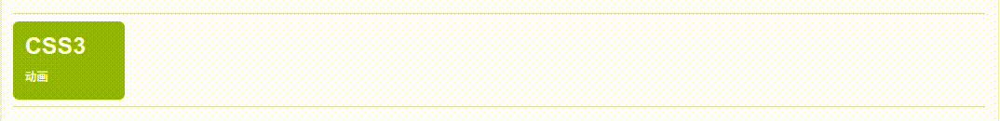
## 上回说到
当我们使用`:hover`时，可以设置鼠标悬停样式

`:hover`中还有一个参数是`过度速度函数`：CSS 属性受到`transition effect`的影响，会产生不断变化的中间值，而`CSS transition-timing-function`属性用来描述这个中间值是怎样计算的。实质上，通过这个函数会建立一条`加速度曲线`，因此在整个`transition`变化过程中，变化速度可以不断改变

`transition-timing-function`有两种主要的过度形式，一种是`平滑过度`，一种是`步进帧过度`

### 平滑过度
#### 平滑过度我们通过贝塞尔曲线(bezier)来实现

bezier曲线(函数)在后续的animation动画中也有应用

1. `ease`
>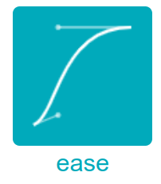

>这个参数会使过度动画呈现`慢-快-非常慢`的效果

2. `linear`
>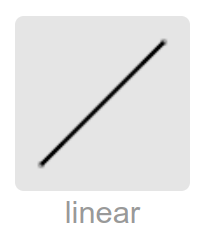

>这个参数会使过度动画`匀速变化`(默认值)

3. `ease-in`
>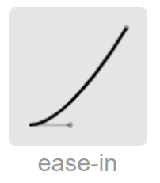

>这个参数会使过度动画从开始发生过度到过度结束的过程`先慢后快`的效果

4. `ease-out`
>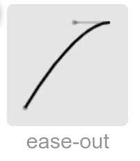

>这个参数会使过度动画呈现从过度完成到回到原状`先慢后快`的效果

5. `ease-in-out`
>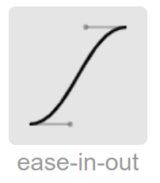

>这个参数会使过度动画无论是开始过度还是过度开始恢复原状时均`先慢后快`

### 步进帧过度
步进帧过度看起来的效果是一帧一帧动的，相较于平滑过度帧率更低，多用于配合`animation`实现打印动画，应用范围较窄

```CSS
transition-timing-function: step(Frame rate, start/end);

Frame rate:帧率，动画要在多少帧完成

start:动画从一开始就开始发生变化

end:动画在最后发生变化(类似加了transition-delay)
```


## 立体网页基础

立体网页设计主要分为`立体元素`设计和`空间3D变换`,今天主要介绍第一个，就是我们如何实现一个元素，让他看起来是具有立体效果的

### transform属性(控制元素在二维平面或三维空间内变换)

今天我们重点介绍二维变换
```
transform: ...;
```
`...`里面是一个函数，控制你想实现怎样的变换，有这么几个函数
1. #### translate(x, y)
> 这个函数实现的是在二维平面的`位移`变换，x和y是延x轴正方向和y轴正方向唯一的距离
```css
transform: translate(20px, 30px);

transform: translateX(-20px);

transform: translateY(30px);
```

2. rotate(angle)
> 二维平面的`旋转`，angle参数是旋转角度

```css
transform: rotate(45deg);

transform: rotate(-90deg);
```
3. scale(...)
> 二维`缩放`
```css
transform: scale(1); //大小不变

transform: scale(0.7); //缩小0.7倍

transform: scale(1.3); //放大1.3倍

transform: scaleX(3.2);

transform: scaleY(1.1);
```

4. skew(angleX, angleY)
> 下面重点介绍

### 伪元素`::before`和`::after`

1. `::before`
>"::before" 伪元素可以在元素的内容前面插入新内容

1. `::after`
>":after" 伪元素可以在元素的内容之后插入新内容

伪元素和普通的标签一样，可以设置CSS样式，同样定位也是可以生效在伪元素上的，比如

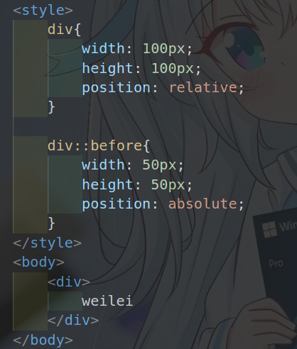

我们给`::before`设置absolute定位，`::before`会找到上一级相对定位的div，跟我们在父div里面设置子div绝对定位是一样的效果

同样的`::after`也是一样的效果

#### 所以我们可以使用`::before`和`::after`+`定位`的组合可以实现3D立体效果,具体怎么实现呢？

这里我们还需要引入一个新东西，transform里面的`skew`函数，`skew()定义了一个元素在二维平面上的倾斜转换`

1. `skewX()`设置X方向上的偏移量:x轴水平向右为正向

>`transform: skewX(45deg);`

>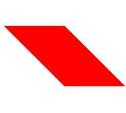

>`transform: skewX(-45deg);`

>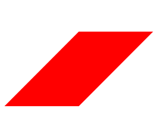

2. `skewY()`设置Y方向上的偏移量：y轴垂直向下为正向
>`transform: skewY(45deg);`

>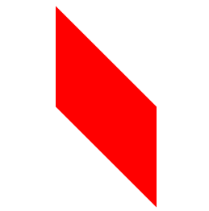

>`transform: skewY(-45deg);`

>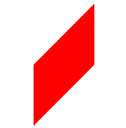


### 实现3D立体盒子动画(视频展示)
大致步骤：
1. 一个大div,设置X或Y轴偏移量，里面嵌套n个小div（n的个数看你要堆放几个立体盒子，如果只有一个立体图形，就嵌套一个div即可）
2. 对小div设置伪元素`::before`和`::after`
3. 小div相对定位，伪元素绝对定位
4. 修改伪元素的`top`和`left`属性,并添加X或Y轴方向上的偏移量，实现3D盒子封闭效果，需要结合`transform-origin`
5. 多个立体盒子的需要对小div设置`z-index`属性，突出上下层关系
6. 对小div设置`:hover`伪类，伪类里面修改`transform:translate();`属性实现位移效果

## CSS动画(Animation)

大家都或多或少的在网页中看到各式各样的动画效果，有的是视频，有的是gif...这种动画形式并没有对标签本身进行修改，也就是标签的CSS属性进行修改，而`animation实现动画效果的本质其实是对标签的CSS属性进行更改`，<b>不依赖任何外部事件</b>(如点击或鼠标悬停)从而达到了时刻在动的效果

#### 那我们如何设置动画呢？

我们要在要实现动画效果的元素中设置`animation`属性

```css
animation: name duration timing-function delay iteration-count direction fill-mode play-state;
```

参数有点多，但是很多时候不需要全写，我们来一个一个看

1. #### name(指定要绑定到选择器的关键帧的名称)

#### 什么是关键帧？
```
关键帧就是当我们的动画进行到这一帧时的css样式

我们从一个关键帧到另一个关键帧之间的CSS样式改变，浏览器会自动帮我们完成
```

#### `name`我们使用CSS的@keyframes规则进行声明

```
@keyframes name{
    ...
}
```

#### 如何设置关键帧？
```css
//使用from...to...关键字
@keyframes name{
    from{
        css属性
    }
    to{
        css属性
    }
}

//使用%控制动画进程
@keyframes name{
    0%{
        css属性
    }
    50%{
        css属性
    }
    100%{
        css属性
    }
}
```

我们最常用的是第二种样式，因为from...to...关键字，就代表着关键帧从0%到100%

这里的0%和100%你可以理解为动画的进程，0%意味着动画初始状态，100%意味着动画结束状态，中间可以设置(0,100)的任意数字控制关键帧，来实现各种复杂的动画效果

注意这里用的是(0,100)是个开区间，意味着你在0%和100%之间你可以写0.11%,也可以写99.9999%


2. #### duration(动画指定需要多少秒或毫秒完成)

3. #### timing-function	(设置动画将如何完成一个周期)

4. #### delay (设置动画在启动前的延迟间隔)

5. #### iteration-count	(定义动画的播放次数)
```css
animation-iteration-count: value;

value:

n 动画播放n次

infinite 无限次播放
```
6. #### direction (指定是否应该轮流反向播放动画)
```css
animation-direction: normal|reverse|alternate|alternate-reverse|initial|inherit;

normal:正向播放

reverse：反向播放

alternate:奇数次{1, 3, 5, }正向播放，偶数次{2, 4, 6, }反向播放

alternate-reverse:与上面相反
```
7. #### fill-mode (规定当动画不播放时（当动画完成时，或当动画有一个延迟未开始播放时），要应用到元素的样式)

8. #### play-state (指定动画是否正在运行或已暂停)
```css
animation-play-state: paused|running;

paused:停止
running：进行
```